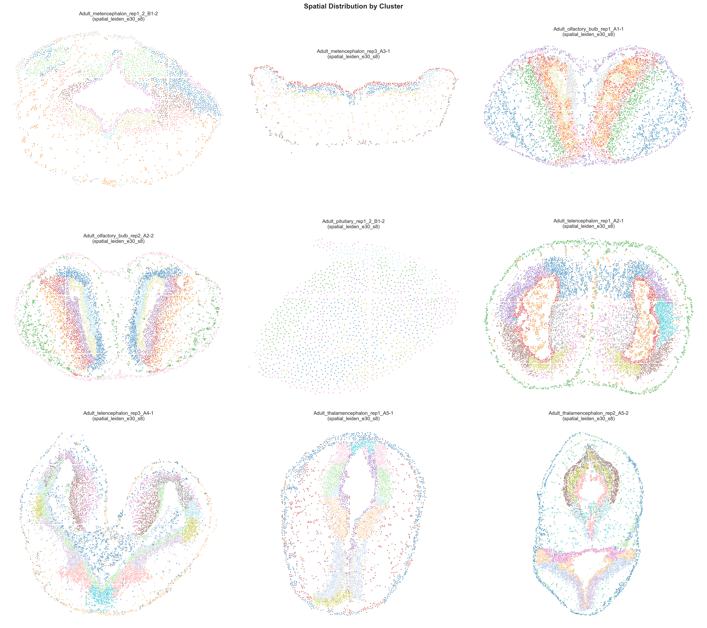

# Fengalotl 🦎

[](https://www.python.org/downloads/)
[](https://shiny.posit.co/py/)

An interactive Shiny application for exploring spatial transcriptomics data from the axolotl brain.

## 📋 Overview

Fengalotl provides an interactive web interface to explore spatial gene expression data from adult axolotl brain regions, including:


*Leiden clusters across all 10 spatial transcriptomics samples. Full-resolution PDF: [spatial_clusters.pdf](spatial_clusters.pdf)*

| Brain Region | Replicates |
|--------------|------------|
| 🧠 Metencephalon (hindbrain) | 2 |
| 👃 Olfactory bulb | 2 |
| 🔴 Pituitary | 1 |
| 🧩 Telencephalon (forebrain) | 2 |
| 🔷 Thalamencephalon (diencephalon) | 3 |

## ✨ Features

- **Spatial visualization** — spot-level gene expression in spatial coordinates
- **UMAP projection** — 2D UMAP with cluster overlays, pre-computed for all datasets
- **Cluster overlays** — Leiden clustering, structure annotation, or Seurat clusters
- **Gene expression overlay** — per-gene expression mapped to both UMAP and spatial plots
- **G2M cell-cycle score** — computed on demand from canonical marker genes, shown on both plots
- **Annotated gene names** — AMEX gene IDs mapped to Axolotl Tanaka annotations
- **Fast loading** — full in-memory caching with mtime invalidation; glasbey palettes and gene choice dicts cached across dataset switches

---

## 🚀 Installation

### Requirements
- Python 3.12 or higher
- [conda](https://docs.conda.io/) or [mamba](https://mamba.readthedocs.io/) (recommended)

### Setup

```bash
# Create and activate environment
mamba create -n fengalotl python=3.12
mamba activate fengalotl

# Clone the repository
git clone --branch main https://github.com/SebastianBohm/Fengalotl.git
cd fengalotl

# Install the package
pip install -e .
```

---

## 📊 Data Setup

### Required Files

Place the processed `.h5ad` files and the annotation CSV in `data/`:

```
data/
├── Adult_metencephalon_rep1_2_DP8400015234BL_B1-2_final.h5ad
├── Adult_metencephalon_rep3_DP8400015234BL_A3-1_final.h5ad
├── Adult_olfactory_bulb_rep1_DP8400015234BL_A1-1_final.h5ad
├── Adult_olfactory_bulb_rep2_DP8400015234BL_A2-2_final.h5ad
├── Adult_pituitary_rep1_2_DP8400015234BL_B1-2_final.h5ad
├── Adult_telencephalon_rep1_DP8400015234BL_A2-1_final.h5ad
├── Adult_telencephalon_rep3_DP8400015234BL_A4-1_final.h5ad
├── Adult_thalamencephalon_rep1_DP8400015234BL_A5-1_final.h5ad
├── Adult_thalamencephalon_rep2_DP8400015234BL_A5-2_final.h5ad
├── Adult_thalamencephalon_rep3_DP8400015234BL_A6-1_final.h5ad
└── Adult_meta_DGE_markers.csv
```

Each `_final.h5ad` must contain:
- `obsm['spatial']` — 2D spatial coordinates
- `obsm['X_umap']` — 2D UMAP coordinates (pre-compute with `scripts/precompute_umap.py` if missing)
- `obs['spatial_leiden_e30_s8']` — Leiden cluster labels

### Pre-computing UMAP (if needed)

If any file is missing `X_umap`, run once:

```bash
python scripts/precompute_umap.py
```

---

## 🖥️ Running the App

### Local Machine

```bash
mamba activate fengalotl
python -m shiny run src/fengalotl/app.py
```

Open your browser at **http://localhost:8000**

### Remote Server

1. Connect with port forwarding:
```bash
ssh -L 12345:localhost:8000 username@server
```

2. On the server:
```bash
mamba activate fengalotl
cd fengalotl
shiny run src/fengalotl/app.py --port 8000
```

3. Open locally at **http://localhost:12345**

---

## 🎮 Usage Guide

1. **Select a dataset** from the dropdown — the app auto-discovers all `_final.h5ad` files in `data/`
2. **Choose a clustering** resolution (Leiden, Structure annotation, or Seurat clusters)
3. **Toggle cluster colours** with the "Show clusters" switch
4. **Search for a gene** — the dropdown is filtered to genes present in the selected dataset, with annotated names
5. **Plot expression** — enable "Plot gene expression" to overlay expression on both UMAP and spatial plots
6. **G2M score** — enable "Show G2M score" to visualise cell-cycle activity
7. **Adjust dot sizes** with the UMAP and Space sliders independently

---

## 📁 Project Structure

```
Fengalotl/
├── data/                       # H5AD data files + annotation CSV
├── scripts/
│   └── precompute_umap.py      # One-time UMAP pre-computation script
├── src/fengalotl/
│   ├── app.py                  # Shiny app entry point
│   ├── _constants.py           # Dataset discovery, gene annotations, G2M genes
│   ├── fct/
│   │   ├── load.py             # Data loading with in-memory mtime cache
│   │   ├── spatial_widget.py   # Spatial plot (clusters + expression)
│   │   └── umap_widget.py      # UMAP plot (clusters + expression + G2M)
│   ├── js/
│   │   └── _format.py          # Selectize dropdown formatting
│   └── mod/
│       ├── server.py           # Shiny reactive server logic
│       └── ui.py               # Shiny UI layout
├── setup.py
├── pyproject.toml
└── README.md
```

---

## 📈 QC Summary

| Sample | Brain Region | Median Genes | Median UMIs | Cells | Recommended |
|--------|-------------|-------------:|------------:|------:|:-----------:|
| Adult_olfactory_bulb_rep1_…A1-1 | olfactory_bulb | 912 | 1,050 | 6,659 | |
| Adult_olfactory_bulb_rep2_…A2-2 | olfactory_bulb | 1,189 | 1,349 | 6,261 | ✓ |
| Adult_telencephalon_rep1_…A2-1 | telencephalon | 1,330 | 1,499 | 7,987 | ✓ |
| Adult_telencephalon_rep3_…A4-1 | telencephalon | 796 | 881 | 7,566 | |
| Adult_thalamencephalon_rep1_…A5-1 | thalamencephalon | 1,642 | 1,970 | 4,530 | ✓ |
| Adult_thalamencephalon_rep2_…A5-2 | thalamencephalon | 1,408 | 1,695 | 5,837 | |
| Adult_thalamencephalon_rep3_…A6-1 | thalamencephalon | 1,344 | 1,619 | 5,237 | |
| Adult_metencephalon_rep1_2_…B1-2 | metencephalon | 1,257 | 1,524 | 3,188 | ✓ |
| Adult_metencephalon_rep3_…A3-1 | metencephalon | 757 | 870 | 1,296 | |
| Adult_pituitary_rep1_2_…B1-2 | pituitary | 1,560 | 1,822 | 1,364 | ✓ |

Recommended samples have the highest median genes within their brain region.

---

## 🙏 Acknowledgments

- **Adnan** for the template
- **Mateja** for discovering the data